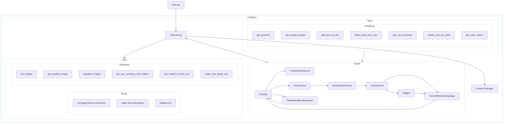

# Pizza Store

## Overview

The pizza store project features a fictitious pizza shop built on Shopify. The agent in the system autonomously interacts with the Shopify API. Its primary function is to facilitate customer order placement, processing text input from the broader xRx system. In entire xRx project, this directory contains the code which powers the "Reasoning Agent" which is shown in blue the image below.

## Getting Started

### Prerequisites

Install `Docker`, `Python3`, `Pip3`, `redis` with [homebrew](https://formulae.brew.sh/) on MacOS or `apt-get update` on Debian/Ubuntu based Linux systems
```bash
brew cask install docker
brew install python@3.10
brew install node@18
brew install redis
```

### API Keys
- Access to an OpenAI compatible endpoint with `chat/completions` capabilities. We recommend using Groq for best performance in this repository. Visit https://console.groq.com/docs/quickstart to create your Groq API key. The following environment variables are the needed for LLM usage.
    - `LLM_API_KEY`
    - `LLM_BASE_URL`
    - `LLM_MODEL_ID`
    - `LLM_MODEL_ID_JSON_FIXER` (this is the model which helps correct any JSON errors potentially made by `LLM_MODEL_ID`)
- Access to a Shopify admin API and GraqhQL API. The following environment variables available for Shopify API usage. Create a Shopify store at https://partners.shopify.com/ to retrieve these keys
    - `SHOPIFY_TOKEN`
    - `SHOPIFY_API_KEY`
    - `SHOPIFY_SHOP`

---

### Environment Variables

To set up the environment variables, create a `.env` file. You can use the provided `env-example` file as a template.

Here's an example of what your `.env` file should include:

1. Language Model (LLM) Configuration:
   - `LLM_API_KEY`: Your API key for the language model service (e.g., OpenAI, Groq)
   - `LLM_BASE_URL`: The base URL for the language model API
   - `LLM_MODEL_ID`: The ID of the language model to use
   - `LLM_MODEL_ID_JSON_FIXER`: The model ID for JSON error correction

2. Shopify Configuration:
   - `SHOPIFY_TOKEN`: Your Shopify admin API token
   - `SHOPIFY_API_KEY`: Your Shopify API key
   - `SHOPIFY_SHOP`: Your Shopify shop name

3. UI Configuration:
   - `NEXT_PUBLIC_UI`: Set to either "pizza-agent" or "shoe-agent" depending on the UI you want to display.

## How To Run


### Locally with Docker
```bash
docker build -t xrx-reasoning:latest .
docker run -it --rm \
--env-file ./.docker.env \
xrx-reasoning:latest
```
Once the containers are up and running, you should be able to visit the API docs at [http://localhost:8003/docs](http://localhost:8003/docs)

### Locally without Docker

#### Start a local redis cluster

```bash
redis-server --port 6379
```

If you are running a local redis cluster, you should also set the `REDIS_HOST` environment variable to the host of your redis cluster. This can be done by adding the following line to your `.env` file:

```
REDIS_HOST=localhost
```
#### Setup the Python Virtual Environment.
```bash
python3 -m venv myenv
source myenv/bin/activate
```

#### Install requirements
```bash
pip install -r requirements.txt
cd app
uvicorn --reload --port 8003 --env-file ../../../.env main:app --log-config logging_config.yaml
```
If you get the following error, it means you are not in the *app* directory
```
ERROR:    Error loading ASGI app. Could not import module "main".
```

Now you have the app/container up and running at [http://localhost:8003](http://localhost:8003)

Here is an example POST request you can now make to the server
```bash
curl --location 'http://127.0.0.1:8003/run-reasoning-agent' \
--header 'Content-Type: application/json' \
--data '{
    "session": {
        "id": "1234567890"
    },
    "messages": [
        {"role": "user", "content": "What kind of food do you have?"}
    ]
}'
```

### Chat interface for testing

Once you have the API up and running, in a separate terminal, go to `shopify-agent/tests` directory. 

From there, in another fresh python environment, install the dependencies

```bash
pip install -r requirements.txt
```

Then run the following command to start the chat interface

```
python interactive_test.py
```

You should see a terminal interface which looks like this

```
Interactive Shopify Agent Test. Type 'quit' to exit.
Customer:
```

You can then chat with the agent via the `Customer:` input in the terminal. Happy testing!


### Command Line Interface for testing

To run single turn and multi-turn tests

```
python -m unittest shopify-agent.test.test.TestShopifyAgent.test_single_turn_agent_responses

python -m unittest shopify-agent.test.test.TestShopifyAgent.test_multi_turn_agent_responses
```


To run all tests

From within the shopify-agent directory, you can use:
```
python -m unittest test.test
```

From the root directory of your project:
```
python -m unittest shopify-agent.test.test
```


### Structure of the agent

You can find below a graph of the reasoning structure.
